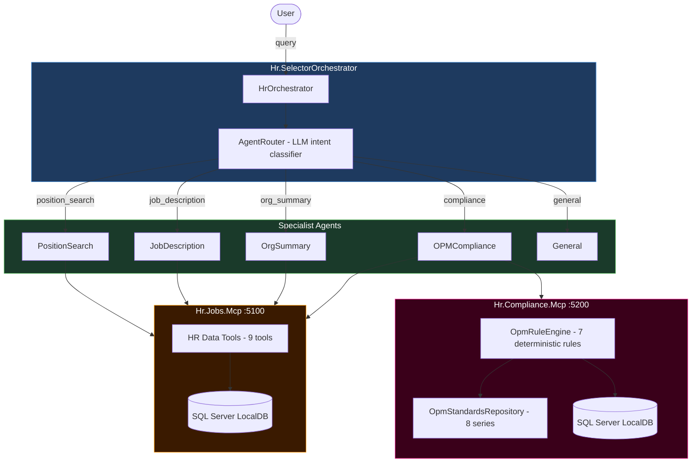

# Dotnet Multi-Agents Tutorial

A hands-on tutorial repository for building **Multi-Agent Systems** with .NET 10, [Microsoft.Extensions.AI](https://learn.microsoft.com/en-us/dotnet/ai/microsoft-extensions-ai), the [Model Context Protocol C# SDK](https://github.com/modelcontextprotocol/csharp-sdk), and the [Microsoft Agent Framework](https://github.com/microsoft/agent-framework) for multi-agent orchestration.

Each part of the series implements a different multi-agent pattern — all using the same federal HR domain (positions, hiring organizations, job descriptions) as the running example.

📖 **Blog Series:** [Building Multi-Agent Systems with .NET 10](blogs/multi-agents/preface-why-one-agent-is-not-enough.md)

---

## What You'll Learn

- How to design multi-agent systems where specialist agents outperform a single general-purpose agent
- Four production-ready orchestration patterns implemented in C#:
  - **Selector** — route each user query to the right specialist
  - **Pipe** — chain agents sequentially, each transforming the output of the last
  - **Group Chat** — run a panel of agents in parallel, then synthesize with a moderator
  - **Evaluator-Optimizer** — loop a critic agent against a drafter until quality is met
- How to connect agents to an MCP server via `ModelContextProtocol` client
- How to use `IChatClient` (Microsoft.Extensions.AI) to stay model-agnostic — swap Ollama for any LLM without touching agent logic
- How the [Microsoft Agent Framework](https://github.com/microsoft/agent-framework) provides the orchestration primitives (`AgentRouter`, `SpecialistAgent`) that wire intent classification to tool-scoped specialist agents

---

## Architecture



---

## Project Structure

```
DotnetMultiAgentsTutorial/
├── DotnetMultiAgents/                       # .NET solution
│   ├── DotnetMultiAgents.slnx
│   └── src/
│       ├── Hr.Core/                         # Domain entities (Position, HiringOrganization)
│       ├── Hr.Application/                  # Application services
│       ├── Hr.Infrastructure/               # EF Core + SQL Server LocalDB
│       ├── Hr.Jobs.Mcp/                     # MCP server — HR data tools          :5100
│       ├── Hr.Compliance.Mcp/               # MCP server — OPM rule engine        :5200
│       │   ├── Rules/
│       │   │   ├── OpmRuleEngine.cs         # 7 deterministic compliance rules
│       │   │   ├── OpmStandardsRepository.cs# 8 OPM occupational series
│       │   │   └── ComplianceResult.cs      # Pass / Warning / Fail per rule
│       │   └── Tools/
│       │       └── ComplianceTools.cs       # MCP tool definitions
│       ├── Hr.ConsoleShared/                # Shared console helpers (banner, export, chat options)
│       ├── Hr.Mcp.Shared/                   # Shared MCP client infra (transport factory, server definition)
│       ├── Hr.Agent/                        # Single-agent baseline (for comparison)
│       ├── Hr.SelectorOrchestrator/                 # ✅ Part 6 — Selector pattern
│       │   ├── Agents/
│       │   │   └── SpecialistAgent.cs       # Configurable specialist agent
│       │   └── Orchestration/
│       │       ├── AgentIntent.cs           # PositionSearch|JobDescription|OrgSummary|Compliance|General
│       │       ├── AgentRouter.cs           # LLM-based intent classifier
│       │       └── HrOrchestrator.cs        # Main selector loop
│       ├── Hr.PipeOrchestrator/                     # ✅ Part 8 — Pipe pattern
│       ├── Hr.GroupChatOrchestrator/                # ✅ Part 9 — Group Chat pattern
│       └── Hr.EvaluatorOrchestrator/                # ✅ Part 10 — Evaluator-Optimizer pattern
├── blogs/
│   └── multi-agents/                        # Blog posts
└── docs/
    └── blog-series-plan.md
```

---

## Blog Series

### Building Multi-Agent Systems with .NET 10

| Part | Title | Code Project |
|------|-------|-------------|
| Preface | [Why One Agent Is Not Enough](blogs/multi-agents/preface-why-one-agent-is-not-enough.md) | — |
| 1 | [The .NET Agent Framework: IChatClient and MCP Clients](blogs/multi-agents/part-1-dotnet-agent-framework.md) | `Hr.SelectorOrchestrator` |
| 2 | [Clean Architecture for AI Applications](blogs/multi-agents/part-2-clean-architecture-for-ai.md) | `Hr.Core` / `Hr.Infrastructure` |
| 3 | [Building the HR Data MCP Server](blogs/multi-agents/part-3-hr-data-mcp-server.md) | `Hr.Jobs.Mcp` |
| 4 | [The Compliance MCP Server: Deterministic Rules, Zero LLM](blogs/multi-agents/part-4-compliance-mcp-deterministic-rules.md) | `Hr.Compliance.Mcp` |
| 5 | [Persisting AI Artifacts: The JobAnnouncement Lifecycle](blogs/multi-agents/part-5-persisting-ai-artifacts.md) | `Hr.Infrastructure` |
| 6 | [The Selector Pattern: Routing to Specialists](blogs/multi-agents/part-6-selector-pattern.md) | `Hr.SelectorOrchestrator` |
| 7 | [Claude Desktop as Your Multi-Agent Platform](blogs/multi-agents/part-7-claude-desktop-multi-agent.md) | — |
| 8 | [The Pipe Pattern: Sequential Agent Stages](blogs/multi-agents/part-8-pipe-pattern.md) | `Hr.PipeOrchestrator` |
| 9 | [The Group Chat Pattern: Parallel Expert Review](blogs/multi-agents/part-9-group-chat-pattern.md) | `Hr.GroupChatOrchestrator` |
| 10 | [The Evaluator-Optimizer Pattern: Quality-Gated Generation](blogs/multi-agents/part-10-evaluator-optimizer-pattern.md) | `Hr.EvaluatorOrchestrator` |

---

## Prerequisites

- [.NET 10 SDK](https://dotnet.microsoft.com/download)
- [SQL Server LocalDB](https://learn.microsoft.com/en-us/sql/database-engine/configure-windows/sql-server-express-localdb) (ships with Visual Studio)
- [Ollama](https://ollama.com) with `gemma4` pulled locally:
  ```bash
  ollama pull gemma4
  ```
- [Duende IdentityServer](https://duendesoftware.com/products/identityserver) container (optional — only needed when `Features:EnableOidc: true`)

---

## Quick Start

```bash
# Clone
git clone https://github.com/workcontrolgit/DotnetMultiAgentsTutorial.git
cd DotnetMultiAgentsTutorial/DotnetMultiAgents

# Build the solution
dotnet build DotnetMultiAgents.slnx

# Run EF Core migrations and seed HR data
dotnet ef database update \
  --project src/Hr.Infrastructure \
  --startup-project src/Hr.Jobs.Mcp
```

All orchestrators and the agent use **stdio transport** by default — they auto-start the MCP servers as child processes. No separate terminal is needed for the MCP servers.

```bash
# Single-agent (interactive chat)
dotnet run --project src/Hr.Agent

# Selector orchestrator (interactive chat, routes to specialists)
dotnet run --project src/Hr.SelectorOrchestrator
```

> **OIDC auth** is disabled by default (`Features:EnableOidc: false` in each `appsettings.json`). Set it to `true` and configure the `Oidc` section to enable JWT Bearer protection on the MCP servers.

---

## Running the Orchestrators

Each orchestrator demonstrates a different multi-agent pattern. They all auto-start the MCP servers they need via stdio.

### Selector — interactive chat, routes to specialists

```bash
dotnet run --project src/Hr.SelectorOrchestrator
```

Type any HR-related question. The router classifies intent and delegates to the right specialist:

- `"Show me all open positions"` → **PositionSearch** agent
- `"Write a job description for position 5"` → **JobDescription** agent
- `"Summarize the hiring organizations"` → **OrgSummary** agent
- `"Run compliance check on position 3"` → **OPMCompliance** agent

---

### Pipe — sequential: draft → compliance check → status update

```bash
dotnet run --project src/Hr.PipeOrchestrator
```

Prompts for a **position ID**, then runs three chained stages automatically:

1. **DraftAgent** — calls `WriteJobDescription` and saves the draft via `SaveJobAnnouncement`
2. **ComplianceAgent** — runs `RunFullComplianceCheck` on the saved announcement
3. **Status update** — calls `UpdateAnnouncementStatus` with `CompliancePassed` or `ComplianceFailed`

Use when you need ordered, dependent transformation steps with a single entry point.

---

### Group Chat — parallel expert review + moderator synthesis

```bash
dotnet run --project src/Hr.GroupChatOrchestrator
```

Prompts for an **announcement ID** and **position ID** (the announcement must already exist — run the Pipe orchestrator first to generate one).

Three reviewers critique the draft in parallel (no shared state, no anchoring bias):

- **HR Specialist** — title accuracy, duties, OPM alignment
- **Legal Reviewer** — EEO language, non-discriminatory phrasing, required legal statements
- **Budget Analyst** — pay grade accuracy, salary range, benefits completeness

A **Moderator** then synthesizes all critiques into a revised draft and saves it.

Use when you need multi-perspective evaluation of a single artifact.

---

### Evaluator-Optimizer — scored generate/improve loop

```bash
dotnet run --project src/Hr.EvaluatorOrchestrator
```

Prompts for a **position ID**, then loops until quality threshold is met or max iterations reached:

1. **GeneratorAgent** — produces (or improves) a job description draft
2. **EvaluatorAgent** — scores it on 4 criteria (Clarity, OPM Language, Completeness, Tone), 25 pts each
3. Loop repeats if score < 80/100, up to 3 iterations
4. Best-scoring draft is saved via `SaveJobAnnouncement` regardless of whether threshold was reached

Use when you need iterative quality improvement with an objective stopping criterion.

---

### Transport modes

All orchestrators default to `stdio` (MCP servers start automatically). To use pre-running HTTP servers instead:

```bash
# Start servers manually
dotnet run --project src/Hr.Jobs.Mcp       # :5100
dotnet run --project src/Hr.Compliance.Mcp # :5200

# Then run any orchestrator in streamHttp mode
dotnet run --project src/Hr.SelectorOrchestrator -- --stream-http
```

---

## MCP Tools

### Hr.Jobs.Mcp — HR data tools (port 5100)

| Tool | Description |
|------|-------------|
| `GetOpenPositions` | All currently open federal job positions |
| `GetPositionById` | Full detail for a specific position |
| `GetPositionsByOrganization` | Positions filtered by hiring organization |
| `GetHiringOrganizations` | All hiring organizations with position counts |
| `WriteJobDescription` | AI-generated job description via Ollama |
| `SaveJobAnnouncement` | Persist a generated draft linked to a position |
| `GetJobAnnouncement` | Retrieve a saved announcement by ID |
| `ListJobAnnouncements` | List all announcements (optionally filter by position) |
| `UpdateAnnouncementStatus` | Advance status: Draft → CompliancePassed / ComplianceFailed / Published |

```bash
npx @modelcontextprotocol/inspector http://localhost:5100/mcp
```

### Hr.Compliance.Mcp — OPM rule engine (port 5200)

| Tool | Description |
|------|-------------|
| `RunFullComplianceCheck` | Runs all 7 OPM rules against a position; returns Pass / Warning / Fail per rule |
| `ValidatePayGrade` | Checks grade format, min ≤ max, and alignment with OPM series standard |
| `CheckApplicationPeriod` | Enforces the 5-business-day minimum announcement window |
| `GetOPMStandard` | Returns allowed grade range and qualification standard URL for a series |
| `ListOPMSeries` | All occupational series known to the compliance server |

```bash
npx @modelcontextprotocol/inspector http://localhost:5200/compliance
```

> **Zero LLM calls in the rule engine.** All compliance decisions are made in deterministic C# code. The `OPMCompliance` specialist agent uses the LLM only to explain results to the user in plain language.

### Sample Rule: Occupational Series Check

The occupational series drives two rules that work together.

**Rule 1 — `CheckPayGradeAlignment`** (series → allowed grade range)

`OpmRuleEngine` calls `OpmStandardsRepository.GetBySeries(position.OccupationalSeries)`.
The repository normalises the code (strips/pads leading zeros) so `"201"` and `"0201"` resolve identically.

```
Position.OccupationalSeries
        │
        ▼
OpmStandardsRepository.GetBySeries()
        │
   ┌────┴─────────────────┐
   │ Not found             │ Found → AllowedGradeNumbers
   ▼                       ▼
Warning                 PayGradeMin + PayGradeMax
"unknown series"        each must be in the allowed list
                              │
                        ┌─────┴─────┐
                        │ Outside    │ Inside
                        ▼            ▼
                       Fail          Pass
                  (+ OPM standard URL)
```

Example — an IT Specialist posted at GS-16 fails because series `2210` only allows GS-05 through GS-15:

```
Rule:    PayGradeAlignment  →  FAIL
Message: Grade GS-16 is outside the allowed range for series 2210
         (Information Technology Management). Allowed: GS-05 to GS-15.
         Standard: https://www.opm.gov/...
```

**Rule 2 — `CheckQualificationsText`** (implicit series enforcement)

This rule does not call the repository, but enforces a consequence of OPM series standards: the qualifications text must explicitly mention the advertised grade level (e.g. `"GS-12"`), because OPM qualification standards are written grade-by-grade.

```
Qualifications text contains "GS-12" (or the advertised grade)?
    Yes → Pass
    No  → Warning: "Qualifications text does not reference the advertised grade"
```

**What is NOT checked** — the `RequiredQualificationKeyword` stored on each `OpmStandard`
(e.g. `"information technology"` for series 2210) is available via the `GetOPMStandard` tool
but no rule currently validates it. This is a natural extension point for a stricter Rule 8.

---

## Tech Stack

| Layer | Technology |
|-------|-----------|
| Multi-agent orchestration | [Microsoft Agent Framework](https://github.com/microsoft/agent-framework) |
| Agent abstraction | `Microsoft.Extensions.AI` 10.* (`IChatClient`) |
| Local LLM | `OllamaSharp` 5.* (`OllamaApiClient`) — default model: `gemma4` |
| MCP server SDK | [`ModelContextProtocol` 1.*](https://github.com/modelcontextprotocol/csharp-sdk) |
| MCP client SDK | [`ModelContextProtocol.Core`](https://github.com/modelcontextprotocol/csharp-sdk) (via `ModelContextProtocol`) |
| Auth | Duende IdentityServer — client credentials flow (optional) |
| Persistence | EF Core 9 + SQL Server LocalDB |
| Target framework | .NET 10 |

---

## Related Repositories

- [DotnetAiAgentMcp](https://github.com/workcontrolgit/DotnetAiAgentMcp) — Build a single AI agent with MCP tools in .NET 10 (the foundation this series extends)
- [AngularNetTutorial](https://github.com/workcontrolgit/AngularNetTutorial) — Full-stack Angular 20 / .NET 10 / Duende IdentityServer

---

## License

MIT
