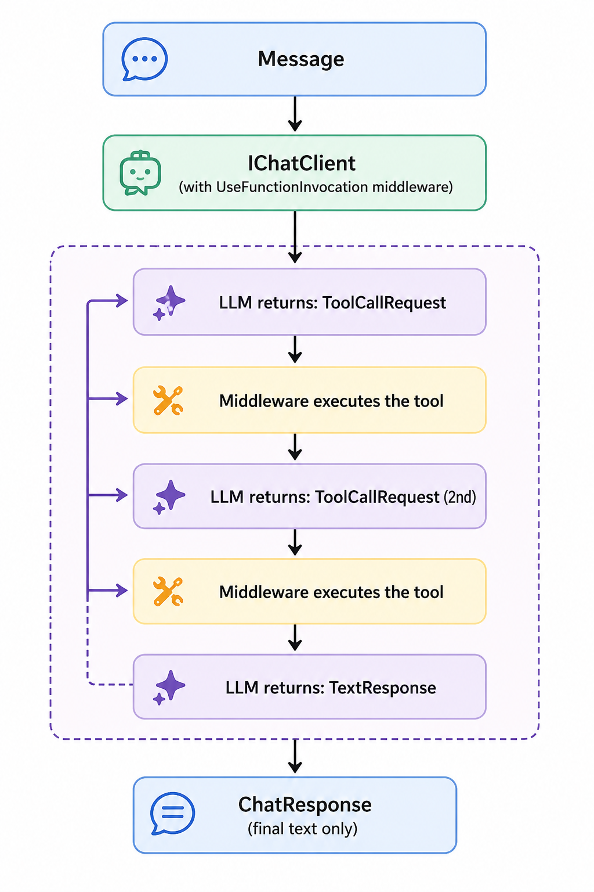

# Part 1 — The .NET Agent Framework: IChatClient and MCP Clients

*Part 1 of: Building Multi-Agent Systems with .NET 10*

---

**Series:** [Preface](preface-why-one-agent-is-not-enough.md) · **Part 1** · [Part 2](part-2-clean-architecture-for-ai.md) · [Part 3](part-3-hr-data-mcp-server.md) · [Part 4](part-4-compliance-mcp-deterministic-rules.md) · [Part 5](part-5-persisting-ai-artifacts.md) · [Part 6](part-6-selector-pattern.md) · [Part 7](part-7-claude-desktop-multi-agent.md) · [Part 8](part-8-pipe-pattern.md) · [Part 9](part-9-group-chat-pattern.md) · [Part 10](part-10-evaluator-optimizer-pattern.md)

← [Preface](preface-why-one-agent-is-not-enough.md) &nbsp;|&nbsp; [Part 2 — Clean Architecture for AI Applications →](part-2-clean-architecture-for-ai.md)

*Medium: [← Preface](MEDIUM_URL_PREFACE) | [Part 2 →](MEDIUM_URL_PART_2)*

---

If you have built an agent before, you have used `IChatClient`. You may have treated it as a thin wrapper around an HTTP call to Ollama or OpenAI. In a multi-agent system, it is much more than that — it is the abstraction that lets you run 5 agents backed by 5 different model configurations, all with a single line of code change.

This post unpacks the abstractions beneath a multi-agent system: `IChatClient`, the `UseFunctionInvocation` middleware, and the MCP client that turns remote tool servers into local tool lists. By the end you will understand exactly what happens between "user types a message" and "agent calls a tool."

---

## IChatClient: The Universal Agent Primitive

`IChatClient` is the core interface from `Microsoft.Extensions.AI`. Its fundamental method is:

```csharp
Task<ChatResponse> GetResponseAsync(
    IEnumerable<ChatMessage> messages,
    ChatOptions? options = null,
    CancellationToken cancellationToken = default);
```

That is the entire contract. Messages in, response out. Every LLM backend — Ollama, OpenAI, Azure OpenAI, Anthropic — implements this interface identically from the caller's perspective.

In this project, the local Ollama backend is provided by `OllamaSharp`:

```csharp
// src/Hr.SelectorOrchestrator/Program.cs
IChatClient BuildClient(bool withFunctionInvocation)
{
    var builder = ((IChatClient)new OllamaApiClient(
            new Uri("http://localhost:11434"), "llama3.2"))
        .AsBuilder();

    if (withFunctionInvocation)
        builder.UseFunctionInvocation();

    return builder.Build();
}
```

Two things to notice here.

**The cast is required.** `OllamaApiClient` implements both `IChatClient` and `IEmbeddingGenerator`. Without the explicit cast to `IChatClient`, the compiler cannot resolve which `.AsBuilder()` overload to call and throws an ambiguity error. This is a known gotcha with `OllamaSharp` 5.x — cast first, then chain.

**Two client configurations.** The router client skips `UseFunctionInvocation`. The agent client includes it. This is intentional and important.

---

## The UseFunctionInvocation Middleware

`UseFunctionInvocation()` adds a middleware layer that intercepts the LLM response, detects tool call requests, executes the corresponding .NET methods, and feeds results back to the model — automatically, in a loop, until the model produces a final text response.

Without it, your code receives a `ChatResponse` containing a tool call request and you have to handle execution manually. With it, tool calls are transparent: you send a message, you get a text response, everything in between is handled.



The router does not use this middleware because it never calls tools. It classifies intent and returns a label. Adding `UseFunctionInvocation` to the router would add overhead for a capability it will never use.

---

## MCP Tools as AITool

The agent's tools come from two MCP servers. Connecting to each is three lines:

```csharp
// src/Hr.SelectorOrchestrator/Program.cs
await using var hrMcpClient = await McpClient.CreateAsync(
    new HttpClientTransport(new HttpClientTransportOptions
    {
        Endpoint          = new Uri("http://localhost:5100/mcp"),
        AdditionalHeaders = new Dictionary<string, string>
            { ["Authorization"] = $"Bearer {accessToken}" }
    }));

var hrTools = (await hrMcpClient.ListToolsAsync()).Cast<AITool>().ToList();
```

`ListToolsAsync()` returns `IList<McpClientTool>`. The `.Cast<AITool>()` converts them to the standard `AITool` type that `ChatOptions.Tools` accepts.

This is the key architectural insight: **once cast, an MCP tool is indistinguishable from a local tool.** The agent has no idea whether `GetOpenPositions` runs in-process or on a server at port 5100. The `UseFunctionInvocation` middleware handles both identically.

```csharp
Console.WriteLine($"HR tools: {string.Join(", ", hrTools.Select(t => t.Name))}");
// HR tools: GetOpenPositions, GetPositionById, GetPositionsByOrganization,
//           GetHiringOrganizations, WriteJobDescription, SaveJobAnnouncement,
//           GetJobAnnouncement, ListJobAnnouncements, UpdateAnnouncementStatus
```

The same pattern repeats for the compliance server at port 5200, yielding 5 more tools.

---

## From One Agent to Many: The SpecialistAgent Wrapper

The single-agent baseline (`Hr.Agent`) passes all 14 tools to one `IChatClient`:

```csharp
// src/Hr.Agent/HrAgent.cs  (simplified)
var response = await chatClient.GetResponseAsync(
    messages,
    new ChatOptions { Tools = [.. allHrTools, .. allComplianceTools] });
```

The multi-agent orchestrator wraps the same `IChatClient` in a `SpecialistAgent` that scopes the tool list and pins the system prompt:

```csharp
// src/Hr.SelectorOrchestrator/Agents/SpecialistAgent.cs
public sealed class SpecialistAgent(
    string name,
    string systemPrompt,
    IChatClient chatClient,
    IReadOnlyList<AITool> tools)
{
    public string Name { get; } = name;

    public async Task<string> HandleAsync(string userQuery, CancellationToken ct = default)
    {
        var messages = new List<ChatMessage>
        {
            new(ChatRole.System, systemPrompt),
            new(ChatRole.User, userQuery),
        };
        var response = await chatClient.GetResponseAsync(
            messages,
            new ChatOptions { Tools = [.. tools] },
            ct);
        return response.Text ?? string.Empty;
    }
}
```

This is the entirety of a specialist agent. The power comes from what you pass in, not from any framework magic.

The job description specialist is created like this:

```csharp
// src/Hr.SelectorOrchestrator/Program.cs
var jdTools = hrTools
    .Where(t => t.Name is "WriteJobDescription" or "GetPositionById"
                       or "SaveJobAnnouncement" or "GetJobAnnouncement"
                       or "ListJobAnnouncements")
    .ToList();

var jobDescriptionAgent = new SpecialistAgent(
    name: "JobDescription",
    systemPrompt: """
        You are a federal HR writing specialist. Your job is to generate professional
        job descriptions.
        - Always call WriteJobDescription with the position ID.
        - After generating, call SaveJobAnnouncement to persist the draft.
        - If the user hasn't given you a position ID, ask which role they want,
          or use GetPositionById if they gave you the title.
        """,
    chatClient: agentClient,
    tools: jdTools);
```

Five tools. A 60-word system prompt. That is the entire job description specialist.

Compare that to the compliance specialist:

```csharp
var complianceAgentTools = complianceTools
    .Concat(hrTools.Where(t => t.Name is "GetPositionById" or "UpdateAnnouncementStatus"))
    .ToList();

var complianceAgent = new SpecialistAgent(
    name: "OPMCompliance",
    systemPrompt: """
        You are a federal HR compliance specialist. Check whether positions
        meet OPM standards before announcement.
        - Use RunFullComplianceCheck for a complete report.
        - If the user provides an announcement ID, call UpdateAnnouncementStatus
          after the check completes.
        - Clearly state PASS, WARNING, or FAIL for each rule.
        - For failures, suggest specific corrections.
        """,
    chatClient: agentClient,
    tools: complianceAgentTools);
```

Seven compliance tools plus two HR tools. A different 70-word prompt. The two agents share the same `agentClient` instance — the underlying `IChatClient` is stateless.

---

## Side-by-Side: Single Agent vs. Specialist Agent

The difference at runtime is stark. Here is what the tool list looks like for each approach:

**Single agent (Hr.Agent):**

```
Tools in context: GetOpenPositions, GetPositionById, GetPositionsByOrganization,
GetHiringOrganizations, WriteJobDescription, SaveJobAnnouncement, GetJobAnnouncement,
ListJobAnnouncements, UpdateAnnouncementStatus, RunFullComplianceCheck, ValidatePayGrade,
CheckApplicationPeriod, GetOPMStandard, ListOPMSeries
Total: 14 tools
```

**JobDescription specialist:**

```
Tools in context: WriteJobDescription, GetPositionById, SaveJobAnnouncement,
GetJobAnnouncement, ListJobAnnouncements
Total: 5 tools
```

The specialist agent's LLM context is 64% smaller for tool descriptions alone. The model does not have to consider compliance tools when writing a job description. It cannot accidentally call `RunFullComplianceCheck` mid-draft.

---

## What Comes Next

You now have the framework primitives: `IChatClient`, the `UseFunctionInvocation` middleware, and the MCP client that turns remote tool servers into local tool lists. The next step is to arrange these primitives into a codebase that is testable, maintainable, and swap-friendly at every layer. Part 2 applies clean architecture to the HR system and explains why the LLM belongs in the infrastructure layer, not the domain.

---

**Series:** [Preface](preface-why-one-agent-is-not-enough.md) · **Part 1** · [Part 2](part-2-clean-architecture-for-ai.md) · [Part 3](part-3-hr-data-mcp-server.md) · [Part 4](part-4-compliance-mcp-deterministic-rules.md) · [Part 5](part-5-persisting-ai-artifacts.md) · [Part 6](part-6-selector-pattern.md) · [Part 7](part-7-claude-desktop-multi-agent.md) · [Part 8](part-8-pipe-pattern.md) · [Part 9](part-9-group-chat-pattern.md) · [Part 10](part-10-evaluator-optimizer-pattern.md)

← [Preface](preface-why-one-agent-is-not-enough.md) &nbsp;|&nbsp; [Part 2 — Clean Architecture for AI Applications →](part-2-clean-architecture-for-ai.md)

*Medium: [← Preface](MEDIUM_URL_PREFACE) | [Part 2 →](MEDIUM_URL_PART_2)*

---

## References

### NuGet Packages

- [Microsoft.Extensions.AI](https://www.nuget.org/packages/Microsoft.Extensions.AI) — `IChatClient`, `ChatMessage`, `AITool`, and the `UseFunctionInvocation` middleware
- [OllamaSharp](https://www.nuget.org/packages/OllamaSharp) — `OllamaApiClient` implements `IChatClient`; cast to `IChatClient` before calling `.AsBuilder()`
- [ModelContextProtocol](https://www.nuget.org/packages/ModelContextProtocol) — MCP server SDK
- [ModelContextProtocol.Core](https://www.nuget.org/packages/ModelContextProtocol.Core) — MCP client API (`McpClient`, `HttpClientTransport`, `McpClientTool`)

### Microsoft Documentation

- [Microsoft.Extensions.AI overview](https://learn.microsoft.com/en-us/dotnet/ai/microsoft-extensions-ai) — IChatClient, middleware pipeline, function invocation
- [IChatClient interface](https://learn.microsoft.com/en-us/dotnet/api/microsoft.extensions.ai.ichatclient) — Full API reference

### GitHub

- [DotnetMultiAgentsTutorial](https://github.com/workcontrolgit/DotnetMultiAgentsTutorial) — Full source for all patterns in this series
- [modelcontextprotocol/csharp-sdk](https://github.com/modelcontextprotocol/csharp-sdk) — Official C# MCP SDK
