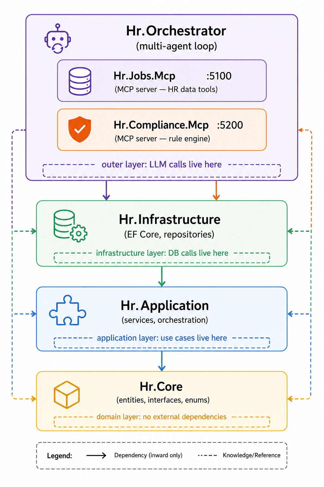

# Part 2 — Clean Architecture for AI Applications

*[Building Multi-Agent Systems with .NET 10 Blog Series](preface-why-one-agent-is-not-enough.md)*

---

Part 1 introduced `IChatClient` and `McpClient` — the two abstractions that power every agent in this series. Before building specialist agents against them, the solution needs a structure that keeps domain logic, application services, and AI infrastructure in their correct layers. This part covers the clean architecture behind the HR system and the database setup that seeds the position data every agent will query.

Clean architecture is not a new idea. You have probably applied it to REST APIs: domain entities at the center, application services in the next ring, infrastructure (databases, HTTP clients) at the edge. The dependency rule flows inward — inner layers know nothing about outer ones.

AI applications follow the same rule, with one addition: **the LLM is infrastructure.** It belongs at the edge, not in the center. Your domain entities, business rules, and application services must never import `Microsoft.Extensions.AI`.

This post walks through exactly how the HR multi-agent system is structured, why each layer boundary exists, and how to set up the database and seed data that powers the whole thing.

---

## The Layer Diagram



Dependency arrows point inward only. `Hr.Jobs.Mcp` knows about `Hr.Application`. `Hr.Application` knows about `Hr.Core`. `Hr.Core` knows about nothing outside itself.

---

## Hr.Core — The Domain Layer

`Hr.Core` has no NuGet dependencies beyond the .NET BCL. It contains:

**Entities** — the business objects:

```csharp
// src/Hr.Core/Entities/Position.cs
public class Position
{
    public int Id { get; set; }
    public string Title { get; set; } = string.Empty;
    public string OccupationalSeries { get; set; } = string.Empty;
    public string PayGradeMin { get; set; } = string.Empty;
    public string PayGradeMax { get; set; } = string.Empty;
    public string Duties { get; set; } = string.Empty;
    public string Qualifications { get; set; } = string.Empty;
    // ... navigation properties, location, schedule, clearance
}
```

```csharp
// src/Hr.Core/Entities/JobAnnouncement.cs
public class JobAnnouncement
{
    public int Id { get; set; }
    public int PositionId { get; set; }
    public Position Position { get; set; } = null!;
    public string DraftText { get; set; } = string.Empty;
    public AnnouncementStatus Status { get; set; } = AnnouncementStatus.Draft;
    public DateTime GeneratedAt { get; set; } = DateTime.UtcNow;
    public DateTime? ComplianceCheckedAt { get; set; }
    public string? ComplianceSummary { get; set; }
}
```

**Enums** — domain vocabulary:

```csharp
// src/Hr.Core/Enums/AnnouncementStatus.cs
public enum AnnouncementStatus
{
    Draft,
    CompliancePassed,
    ComplianceFailed,
    Published
}
```

**Interfaces** — repository contracts:

```csharp
// src/Hr.Core/Interfaces/IPositionRepository.cs
public interface IPositionRepository
{
    Task<IEnumerable<Position>> GetAllAsync(CancellationToken ct = default);
    Task<IEnumerable<Position>> GetOpenPositionsAsync(CancellationToken ct = default);
    Task<Position?> GetByIdAsync(int id, CancellationToken ct = default);
    Task<IEnumerable<Position>> GetByOrganizationAsync(int organizationId, CancellationToken ct = default);
    Task<IEnumerable<Position>> GetBySeriesAsync(string occupationalSeries, CancellationToken ct = default);
}
```

The interfaces live in `Hr.Core`. The implementations live in `Hr.Infrastructure`. The domain layer never sees EF Core.

---

## Hr.Application — The Use Case Layer

`Hr.Application` references only `Hr.Core`. Its services are thin facades that delegate to repository interfaces:

```csharp
// src/Hr.Application/Services/PositionService.cs
public class PositionService(IPositionRepository repo)
{
    public Task<IEnumerable<Position>> GetOpenPositionsAsync(CancellationToken ct = default)
        => repo.GetOpenPositionsAsync(ct);

    public Task<Position?> GetPositionByIdAsync(int id, CancellationToken ct = default)
        => repo.GetByIdAsync(id, ct);

    public Task<IEnumerable<Position>> GetPositionsBySeriesAsync(
        string occupationalSeries, CancellationToken ct = default)
        => repo.GetBySeriesAsync(occupationalSeries, ct);
}
```

```csharp
// src/Hr.Application/Services/JobAnnouncementService.cs
public class JobAnnouncementService(IJobAnnouncementRepository repo)
{
    public Task<JobAnnouncement> SaveDraftAsync(int positionId, string draftText, CancellationToken ct = default)
        => repo.SaveAsync(new JobAnnouncement
        {
            PositionId  = positionId,
            DraftText   = draftText,
            Status      = AnnouncementStatus.Draft,
            GeneratedAt = DateTime.UtcNow,
        }, ct);

    public Task<JobAnnouncement?> UpdateStatusAsync(
        int id, AnnouncementStatus status, string? complianceSummary, CancellationToken ct = default)
        => repo.UpdateStatusAsync(id, status, complianceSummary, ct);
}
```

No LLM calls. No HTTP clients. No EF Core. Pure business logic.

---

## Hr.Infrastructure — The Persistence Layer

`Hr.Infrastructure` implements the repository interfaces using EF Core:

```csharp
// src/Hr.Infrastructure/HrDbContext.cs
public class HrDbContext(DbContextOptions<HrDbContext> options) : DbContext(options)
{
    public DbSet<HiringOrganization>   HiringOrganizations   => Set<HiringOrganization>();
    public DbSet<Position>             Positions             => Set<Position>();
    public DbSet<PositionRemuneration> PositionRemunerations => Set<PositionRemuneration>();
    public DbSet<JobAnnouncement>      JobAnnouncements      => Set<JobAnnouncement>();
}
```

Registration is handled by a single extension method:

```csharp
// src/Hr.Infrastructure/DependencyInjection.cs
public static IServiceCollection AddPersistence(
    this IServiceCollection services, string connectionString)
{
    services.AddDbContext<HrDbContext>(options =>
        options.UseSqlServer(connectionString));

    services.AddScoped<IPositionRepository, PositionRepository>();
    services.AddScoped<IHiringOrganizationRepository, HiringOrganizationRepository>();
    services.AddScoped<IJobAnnouncementRepository, JobAnnouncementRepository>();

    return services;
}
```

Any MCP server that needs database access calls `AddPersistence(connectionString)` in its `Program.cs`. Both `Hr.Jobs.Mcp` and `Hr.Compliance.Mcp` connect to the same `HrMcpDb` database.

---

## The Seed Pipeline

The database is populated from real USAJobs data, not hardcoded fixtures. The pipeline is:

**Step 1 — Fetch from USAJobs API** (`tools/UsaJobsFetcher/Program.cs`)

The fetcher loops through 8 OPM occupational series — IT Management (2210), HR Management (0201), Contracting (1102), and 5 others — and pages through results up to a cap of 300 positions. It writes `data/usajobs-seed.json`. This file is committed to the repository so readers can skip the API key setup.

```bash
dotnet run --project tools/UsaJobsFetcher
# Output:
# Fetching series 2210...
#   page 1: ... → 25 items, kept 23
#   page 2: ... → 25 items, kept 21
# ...
# Wrote 287 positions from 31 organizations
```

**Step 2 — Seed on startup** (`Hr.Infrastructure/DbSeeder.cs`)

When `Hr.Jobs.Mcp` starts, it calls `db.Database.MigrateAsync()` then `DbSeeder.Seed(db, seedPath)`. The seeder reads the JSON file and inserts any organizations and positions not already present, so it is safe to run repeatedly.

**Step 3 — Apply migrations manually when needed**

```bash
dotnet ef database update \
  --project src/Hr.Infrastructure \
  --startup-project src/Hr.Jobs.Mcp
```

---

## MCP as a Service Boundary

The two MCP servers are deployed independently. `Hr.Jobs.Mcp` owns HR data and announcement persistence. `Hr.Compliance.Mcp` owns OPM rule evaluation. They share the database but have no code dependency on each other.

This is the same service boundary principle you use with microservices, applied to AI tool servers. The orchestrator is the only component that connects to both — it composes their capabilities at runtime without coupling them at compile time.

```
Hr.SelectorOrchestrator
  ├── connects to Hr.Jobs.Mcp :5100  (14 tools)
  └── connects to Hr.Compliance.Mcp :5200  (5 tools)

Hr.Jobs.Mcp                    Hr.Compliance.Mcp
  └── HrMcpDb (EF Core)          └── HrMcpDb (EF Core)
```

Both servers point to the same LocalDB connection string. In production you would use a shared SQL Server instance or separate the schemas. For local development, one database instance is simpler.

---

## Shared Infrastructure Libraries

Two library projects sit between the domain layer and the orchestrators, extracting shared concerns so they are not duplicated across all four orchestrator `Program.cs` files.

`Hr.ConsoleShared` provides:
- `StartupBannerWriter` — prints the transport mode, model, and loaded tool list on startup
- `ExportFileSaver` — saves base64-encoded export payloads from MCP tool responses to disk
- `ChatOptionsFactory` — creates `ChatOptions` with a tool list and optional `num_ctx` context window in one call

`Hr.Mcp.Shared` provides:
- `McpServerDefinition` — a record holding a server's name, config path, and transport type
- `McpClientTransportFactory` — reads `Transport:Type` from config and constructs either `StdioClientTransport` or `HttpClientTransport`
- `WorkspaceRootLocator` — resolves the repository root path for stdio transport's working directory
- `PortConflictHelper` — produces a clear error message when an HTTP server port is already in use

Every orchestrator and the standalone agent reference both projects. The domain and application layers do not — they have no dependency on console or transport concerns.

---

## The Payoff: Swappable at Every Layer

Clean architecture earns its keep when requirements change:

- **Swap Ollama for Claude**: change one line in `BuildClient()` in `Hr.SelectorOrchestrator/Program.cs`. No domain or application code changes.
- **Swap SQL Server for PostgreSQL**: change `UseSqlServer` to `UseNpgsql` in `DependencyInjection.cs`. No domain or MCP tool code changes.
- **Add a new specialist agent**: add a new `SpecialistAgent` in `Program.cs` with a different tool subset and system prompt. The existing agents are untouched.
- **Test application logic**: inject mock implementations of `IPositionRepository` and `IJobAnnouncementRepository` in `Hr.Application` tests. No MCP server, no database, no LLM needed.

The LLM being infrastructure means it is also mockable. A test that verifies `JobAnnouncementService.SaveDraftAsync` stores the right data does not need Ollama running.

---

## Setting Up the Project

```bash
# Clone
git clone https://github.com/workcontrolgit/DotnetMultiAgentsTutorial.git
cd DotnetMultiAgentsTutorial/DotnetMultiAgents

# Build all 9 projects
dotnet build DotnetMultiAgents.slnx

# Apply EF migrations and seed data
dotnet ef database update \
  --project src/Hr.Infrastructure \
  --startup-project src/Hr.Jobs.Mcp
```

The solution file (`DotnetMultiAgents.slnx`) is the newer `.slnx` format — a clean XML alternative to `.sln`. Visual Studio 2022 17.10+ and the .NET 10 CLI both support it.

---

## What Comes Next

The layer boundaries are in place and the `JobAnnouncement` lifecycle is designed on paper. Part 3 puts real tools behind the architecture: the HR Jobs MCP server with nine endpoints covering position search, job description generation, and announcement persistence.

---

← [Part 1 — The .NET Agent Framework](part-1-dotnet-agent-framework.md) &nbsp;|&nbsp; [Part 3 — Building the HR Data MCP Server →](part-3-hr-data-mcp-server.md)

---

## References

### NuGet Packages

- [Microsoft.EntityFrameworkCore](https://www.nuget.org/packages/Microsoft.EntityFrameworkCore) — ORM for `HrDbContext`, entities, and migrations
- [Microsoft.EntityFrameworkCore.SqlServer](https://www.nuget.org/packages/Microsoft.EntityFrameworkCore.SqlServer) — SQL Server LocalDB provider
- [Microsoft.EntityFrameworkCore.Tools](https://www.nuget.org/packages/Microsoft.EntityFrameworkCore.Tools) — `dotnet ef` CLI for migrations

### Microsoft Documentation

- [EF Core — Getting Started](https://learn.microsoft.com/en-us/ef/core/get-started/overview/first-app) — DbContext, entities, and DbSet configuration
- [Common web application architectures](https://learn.microsoft.com/en-us/dotnet/architecture/modern-web-apps-azure/common-web-application-architectures) — Clean Architecture layers and dependency rule

### GitHub

- [DotnetMultiAgentsTutorial](https://github.com/workcontrolgit/DotnetMultiAgentsTutorial) — Full source for all patterns in this series
