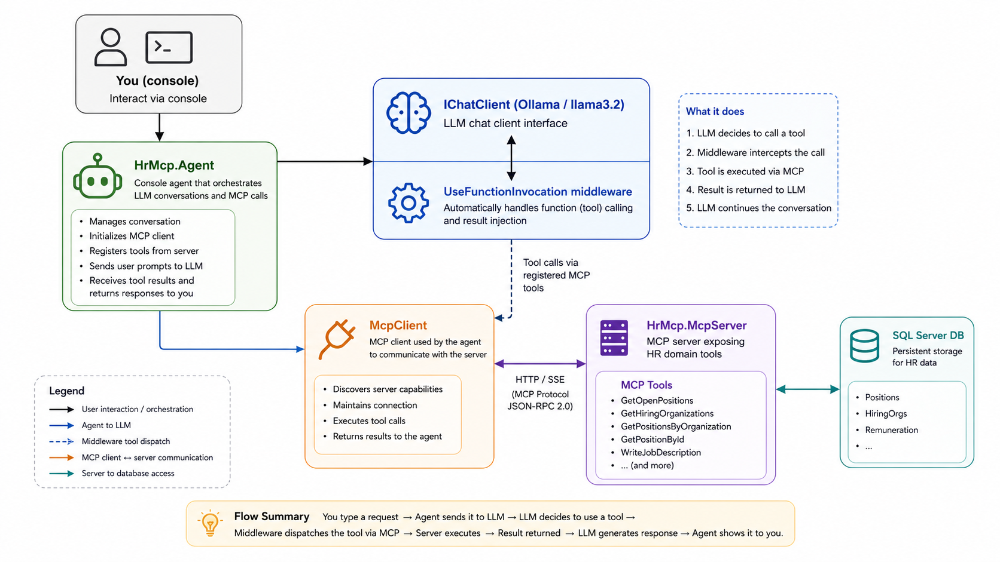

# Part 4: AI Agent with Microsoft.Extensions.AI + Ollama

**Series:** AI Agents & MCP with .NET 10 | **Part 4 of 6**  
**GitHub:** [workcontrolgit/DotnetAiAgentMcp](https://github.com/workcontrolgit/DotnetAiAgentMcp)

---

## Introduction

In Part 3 we built an MCP server with five tools and verified them with MCP Inspector. The tools work — but no AI is involved yet. That changes now.

In this part we wire up the `HrMcp.Agent` console app: it connects to the MCP server over HTTP, hands the tools to an Ollama-backed `IChatClient`, and holds a live conversation where the AI decides which tools to call and when. We also upgrade `WriteJobDescription` from a static template to a real LLM-generated narrative.

By the end you will have a running AI agent that answers HR questions by calling your MCP tools — no hard-coded logic, no manual tool routing.

---

## The Architecture



`Microsoft.Extensions.AI` is the abstraction layer. Ollama is the provider — swap it for Azure OpenAI or any other provider without touching `HrAgent.cs`.

`McpClientTool` bridges the two worlds: it is an `AIFunction` (a `Microsoft.Extensions.AI` type) that dispatches calls to the MCP server over the wire. The chat client's function-invocation middleware handles the loop — call tool, send result back to model, repeat until the model stops calling tools.

---

## Prerequisites

Before running `HrMcp.Agent`, you need Ollama running locally with the `llama3.2` model pulled:

- **Install Ollama** — download from [ollama.com](https://ollama.com) and install
- **Pull the model** — `ollama pull llama3.2`
- **Verify** — `ollama run llama3.2 "Say hello"` (should print a greeting)
- **Confirm the API is up** — `curl http://localhost:11434/api/tags` (lists pulled models)

Ollama runs a local HTTP server on port `11434`. The `OllamaChatClient` points at this address. Nothing leaves your machine.

---

## Step 1 — Packages

### `HrMcp.Agent`

```bash
dotnet add src/HrMcp.Agent package Microsoft.Extensions.AI --version 9.*
dotnet add src/HrMcp.Agent package OllamaSharp --version 5.*
dotnet add src/HrMcp.Agent package ModelContextProtocol --version 1.*
```

The agent is a pure MCP client — it has no direct database access. The two project references to `HrMcp.Application` and `HrMcp.Infrastructure.Persistence` that were scaffolded in Part 1 are removed.

Why three packages:

- **`Microsoft.Extensions.AI`** — `IChatClient`, `ChatMessage`, `ChatOptions`, `AITool` abstractions
- **`OllamaSharp`** — `OllamaApiClient`, the GA-recommended Ollama provider; implements `IChatClient` natively
- **`ModelContextProtocol`** — `McpClient`, `HttpClientTransport`, `McpClientTool`; the client half of the MCP SDK

> **Note:** `Microsoft.Extensions.AI.Ollama` was the early preview provider and is now deprecated in the GA release. The official Microsoft.Extensions.AI GA guidance recommends `OllamaSharp` instead. `OllamaApiClient` (from `OllamaSharp`) implements `IChatClient` directly — no wrapper needed.

### `HrMcp.McpServer`

```bash
dotnet add src/HrMcp.McpServer package OllamaSharp --version 5.*
```

The server needs `OllamaApiClient` to power the `WriteJobDescription` tool upgrade.

---

## Step 2 — `HrAgent.cs`

Create `src/HrMcp.Agent/HrAgent.cs`. This class owns the conversation loop and keeps message history. It takes `IChatClient` and the list of MCP tools as constructor parameters — both are wired in `Program.cs`.

```csharp
// src/HrMcp.Agent/HrAgent.cs
using Microsoft.Extensions.AI;

namespace HrMcp.Agent;

public sealed class HrAgent(IChatClient chatClient, IList<AITool> tools)
{
    private const string SystemPrompt = """
        You are an HR assistant for a U.S. federal agency. You help users explore open job
        positions, hiring organizations, and generate job announcements.

        Guidelines:
        - Always call GetHiringOrganizations before GetPositionsByOrganization to get valid IDs.
        - When asked about open positions, use GetOpenPositions first for an overview, then
          GetPositionById for full detail on a specific role.
        - When asked to write or generate a job description, call WriteJobDescription with the
          position ID — do not write one yourself.
        - Present pay ranges in a readable format (e.g., "$85,000 – $110,000 per year").
        - Keep answers concise; offer to go deeper when the user wants more detail.
        """;

    private readonly List<ChatMessage> _history =
    [
        new(ChatRole.System, SystemPrompt)
    ];

    public async Task RunAsync(CancellationToken ct = default)
    {
        Console.WriteLine("HR Assistant ready. Ask about open positions, organizations, or job descriptions.");
        Console.WriteLine("Type 'exit' to quit.\n");

        while (!ct.IsCancellationRequested)
        {
            Console.Write("You: ");
            var input = Console.ReadLine();

            if (string.IsNullOrWhiteSpace(input)) continue;
            if (input.Equals("exit", StringComparison.OrdinalIgnoreCase)) break;

            _history.Add(new ChatMessage(ChatRole.User, input));

            var response = await chatClient.GetResponseAsync(
                _history,
                new ChatOptions { Tools = tools },
                ct);

            _history.AddMessages(response);

            Console.WriteLine($"\nAssistant: {response.Text}\n");
        }
    }
}
```

Design notes:

- **`IList<AITool> tools`** — typed as `AITool` (the M.E.AI abstraction), not `McpClientTool`. `HrAgent` doesn't know or care that the tools come from MCP.
- **`_history.AddMessages(response)`** — adds all messages from the response (including any tool-call/tool-result messages the middleware appended) back into history for the next turn.
- **`GetResponseAsync`** — the `IChatClient` interface method in `Microsoft.Extensions.AI` 9.x. Returns `ChatResponse`; `.Text` is the assistant's final text.
- **`UseFunctionInvocation` middleware** (set up in `Program.cs`) intercepts tool-call messages, dispatches them to the MCP server, injects the results, and loops until the model produces a text response — all transparently.

---

## Step 3 — `Program.cs` for `HrMcp.Agent`

```csharp
// src/HrMcp.Agent/Program.cs
using Microsoft.Extensions.AI;
using ModelContextProtocol.Client;
using OllamaSharp;
using HrMcp.Agent;

// Connect to the MCP server (must be running on http://localhost:5100)
await using var mcpClient = await McpClient.CreateAsync(
    new HttpClientTransport(new HttpClientTransportOptions
    {
        Endpoint = new Uri("http://localhost:5100/mcp")
    }));

var mcpTools = await mcpClient.ListToolsAsync();
Console.WriteLine($"Connected. Tools: {string.Join(", ", mcpTools.Select(t => t.Name))}\n");

// OllamaApiClient implements IChatClient natively.
// Cast to IChatClient explicitly — OllamaApiClient also implements IEmbeddingGenerator,
// so the cast resolves the AsBuilder() overload ambiguity.
IChatClient chatClient = ((IChatClient)new OllamaApiClient(
        new Uri("http://localhost:11434"), "llama3.2"))
    .AsBuilder()
    .UseFunctionInvocation()
    .Build();

var agent = new HrAgent(chatClient, mcpTools.Cast<AITool>().ToList());
await agent.RunAsync();
```

What each piece does:

- **`McpClient.CreateAsync`** — creates an MCP client connected to the running server via `HttpClientTransport`. In `ModelContextProtocol` 1.x, this replaces the earlier `McpClientFactory.CreateAsync` + `SseClientTransport` pattern.
- **`mcpClient.ListToolsAsync()`** — fetches the tool list from the server. Returns `IList<McpClientTool>`. Each `McpClientTool` is an `AIFunction` (which is an `AITool`) — this is the bridge between the MCP protocol and `Microsoft.Extensions.AI`.
- **`OllamaApiClient`** — the GA-recommended Ollama provider from `OllamaSharp`. Implements `IChatClient` (and `IEmbeddingGenerator`) natively. The explicit `(IChatClient)` cast resolves the `AsBuilder()` overload ambiguity.
- **`UseFunctionInvocation()`** — middleware that intercepts tool-call requests from the model, dispatches them to the MCP server through the `McpClientTool` implementations, and feeds results back into the conversation automatically.
- **`mcpTools.Cast<AITool>()`** — `McpClientTool` inherits from `AIFunction` which inherits from `AITool`, so the cast is safe. `HrAgent` only needs the `AITool` abstraction.

---

## Step 4 — Upgrade `WriteJobDescription` to LLM Output

### Before (Part 3 stub)

```csharp
// Returns a hand-crafted Markdown template
return $"""
    ## {p.Title}
    ...
    *[Stub — LLM-generated narrative added in Part 4]*
    """;
```

### After (Part 4 — LLM-generated)

`JobDescriptionTools.cs` now injects `IChatClient` and calls Ollama to write the narrative:

```csharp
// src/HrMcp.McpServer/Tools/JobDescriptionTools.cs
using System.ComponentModel;
using HrMcp.Application.Services;
using Microsoft.Extensions.AI;
using ModelContextProtocol.Server;

namespace HrMcp.McpServer.Tools;

[McpServerToolType]
public sealed class JobDescriptionTools(PositionService positions, IChatClient chatClient)
{
    [McpServerTool(Name = "WriteJobDescription"),
     Description("Generates a USAJobs-style job announcement for the specified position using AI. Returns a fully written narrative with Summary, Duties, Qualifications, and How to Apply sections.")]
    public async Task<string> WriteJobDescription(
        [Description("The numeric ID of the position to write a description for")] int positionId,
        CancellationToken ct = default)
    {
        var p = await positions.GetPositionByIdAsync(positionId, ct);
        if (p is null) return $"Position {positionId} not found.";

        var prompt = $"""
            Write a compelling USAJobs-style job announcement for the following federal position.
            Use professional government HR writing style. Be specific and engaging.

            Position Data:
            - Title: {p.Title}
            - Department: {p.HiringOrganization?.DepartmentName}
            - Organization: {p.HiringOrganization?.OrganizationName}
            - Series & Grade: {p.OccupationalSeries} | {p.PayGradeMin}–{p.PayGradeMax}
            - Salary: ${p.PositionRemuneration?.MinimumRange:N0} – ${p.PositionRemuneration?.MaximumRange:N0} per year
            - Location: {p.DutyLocation}
            - Telework: {(p.TeleworkEligible ? "Eligible" : "Not eligible")}
            - Security Clearance: {p.SecurityClearance}
            - Who May Apply: {p.WhoMayApply}
            - Description: {p.Description}
            - Duties: {p.Duties}
            - Qualifications: {p.Qualifications}

            Format the output as a complete job announcement with these sections:
            ## Summary
            ## Duties
            ## Qualifications Required
            ## How to Apply
            """;

        var response = await chatClient.GetResponseAsync(
            [new ChatMessage(ChatRole.User, prompt)],
            cancellationToken: ct);
        return response.Text ?? $"Unable to generate description for position {positionId}.";
    }
}
```

The `IChatClient` is registered in `McpServer/Program.cs` as a singleton (shown in Step 5). The tool gets it via constructor injection — no change to how tools are registered with `WithTools<JobDescriptionTools>()`.

---

## Step 5 — Register `IChatClient` in `McpServer/Program.cs`

Add one line to the services block:

```csharp
// src/HrMcp.McpServer/Program.cs
using HrMcp.Application.Services;
using HrMcp.Infrastructure.Persistence;
using HrMcp.McpServer.Tools;
using Microsoft.EntityFrameworkCore;
using Microsoft.Extensions.AI;
using OllamaSharp;

var isStdio = args.Contains("--stdio");

var builder = WebApplication.CreateBuilder(args);

if (isStdio)
{
    builder.Logging.ClearProviders();
    builder.Logging.AddConsole(o => o.LogToStandardErrorThreshold = Microsoft.Extensions.Logging.LogLevel.Trace);
    builder.WebHost.UseUrls();
}

builder.Services.AddPersistence(
    builder.Configuration.GetConnectionString("DefaultConnection")!);
builder.Services.AddScoped<PositionService>();
builder.Services.AddScoped<HiringOrganizationService>();

// IChatClient used by WriteJobDescription tool to generate LLM narratives
builder.Services.AddSingleton<IChatClient>(
    new OllamaApiClient(new Uri("http://localhost:11434"), "llama3.2"));

var mcp = builder.Services
    .AddMcpServer()
    .WithTools<PositionTools>()
    .WithTools<HiringOrganizationTools>()
    .WithTools<JobDescriptionTools>();

if (isStdio)
    mcp.WithStdioServerTransport();
else
    mcp.WithHttpTransport();

var app = builder.Build();

using (var scope = app.Services.CreateScope())
{
    var db = scope.ServiceProvider.GetRequiredService<HrDbContext>();
    db.Database.Migrate();
    var seedPath = Path.Combine(Directory.GetCurrentDirectory(), "data", "usajobs-seed.json");
    DbSeeder.Seed(db, seedPath);
}

if (!isStdio)
    app.MapMcp("/mcp");

await app.RunAsync();
```

`IChatClient` is registered as `Singleton` because `OllamaApiClient` wraps an `HttpClient` and is thread-safe. `JobDescriptionTools` is scoped (registered via `WithTools<>`), so it receives the singleton through normal DI — no lifetime mismatch.

---

## Step 6 — Build

```bash
dotnet build DotnetAiAgentMcp.slnx   # 0 errors, 0 warnings
```

---

## Step 7 — Run a Conversation

Start the MCP server in one terminal:

```bash
dotnet run --project src/HrMcp.McpServer
```

In a second terminal, start the agent:

```bash
dotnet run --project src/HrMcp.Agent
```

You should see:

```text
Connected. Tools: GetOpenPositions, GetPositionById, GetPositionsByOrganization, GetHiringOrganizations, WriteJobDescription

HR Assistant ready. Ask about open positions, organizations, or job descriptions.
Type 'exit' to quit.

You: 
```

### Sample conversation

```text
You: What organizations are hiring right now?
Assistant: Here are the federal hiring organizations currently in the database:

- **U.S. Citizenship and Immigration Services** (Dept. of Homeland Security) — 4 open positions
- **Transportation Security Administration** (Dept. of Homeland Security) — 3 open positions
- **U.S. Coast Guard** (Dept. of Homeland Security) — 2 open positions
- **Federal Emergency Management Agency** (Dept. of Homeland Security) — 1 open position

Would you like to see specific positions for any of these organizations?

You: Show me the IT positions at USCIS

Assistant: I found 2 IT positions at USCIS:

1. **IT Specialist (SYSADMIN)** — GS-2210-11/12, $73,000–$110,000/yr, Washington DC, Telework eligible
2. **IT Specialist (NETWORK)** — GS-2210-09/11, $60,000–$85,000/yr, National Capital Region, Telework not eligible

Both require a Secret security clearance. Would you like full details on either, or shall I write a job announcement for one of them?

You: Write a job description for the SYSADMIN role, position ID 1

Assistant: [Calls WriteJobDescription(positionId: 1) — Ollama generates narrative]

## IT Specialist (SYSADMIN)

### Summary
U.S. Citizenship and Immigration Services (USCIS), within the Department of Homeland Security,
is seeking a highly skilled IT Specialist (Systems Administration) to join our technology team.
In this role, you will be responsible for maintaining the integrity and availability of critical
government systems that support the nationapos;s immigration processing mission...

### Duties
- Administer and maintain Windows Server environments supporting mission-critical applications
- Monitor system performance, implement patches, and coordinate planned maintenance windows
- Collaborate with security teams to ensure systems meet NIST 800-53 control requirements
- Document configurations, change procedures, and incident responses per agency standards
...

### Qualifications Required
Applicants must have one year of specialized experience equivalent to at least the GS-10 level...

### How to Apply
Apply through USAJOBS at www.usajobs.gov. Submit your resume, transcripts, and SF-50 if applicable.
```

The narrative is generated by llama3.2 running locally through Ollama. Each run will produce
slightly different output — that is the nature of a language model.

---

## What Happened Under the Hood

For the question "Show me IT positions at USCIS", the model made two tool calls before answering:

1. **`GetHiringOrganizations`** — to find the USCIS organization ID (following the system prompt guideline)
2. **`GetPositionsByOrganization(organizationId: 1)`** — to retrieve USCIS-specific positions

The `UseFunctionInvocation` middleware handled both dispatches automatically. Your code in
`HrAgent.cs` called `GetResponseAsync` once and got back the final answer — the middleware
looped through tool calls transparently.

For `WriteJobDescription`, the tool itself calls Ollama internally (server-side), so from the
agent's perspective it is just another tool call that returns a string.

---

## What Changed in the SDK (M.E.AI 9.x)

If you have seen older `Microsoft.Extensions.AI` examples, two things changed in 9.x:

- **`CompleteAsync` → `GetResponseAsync`** — the method on `IChatClient` was renamed
- **`ChatCompletion` → `ChatResponse`** — the return type was renamed; use `.Text` for the assistant's text
- **`McpClientFactory` + `SseClientTransport` → `McpClient.CreateAsync` + `HttpClientTransport`** — the MCP client API was updated in `ModelContextProtocol.Core` 1.x

The underlying concepts are identical — the renames are surfaced here so you know why the older patterns no longer compile.

---

## Swapping Providers

`HrAgent.cs` depends only on `IChatClient`. To switch from Ollama to another provider, change
three lines in `Program.cs` — nothing else:

**Azure OpenAI:**
```csharp
IChatClient chatClient = new AzureOpenAIClient(
        new Uri("https://YOUR-RESOURCE.openai.azure.com"),
        new AzureKeyCredential(Environment.GetEnvironmentVariable("AZURE_OPENAI_KEY")!))
    .AsChatClient("gpt-4o")
    .AsBuilder()
    .UseFunctionInvocation()
    .Build();
```

**OpenAI:**
```csharp
IChatClient chatClient = new OpenAIClient(
        new ApiKeyCredential(Environment.GetEnvironmentVariable("OPENAI_KEY")!))
    .AsChatClient("gpt-4o-mini")
    .AsBuilder()
    .UseFunctionInvocation()
    .Build();
```

The required packages (`Microsoft.Extensions.AI.AzureAIInference` or `Microsoft.Extensions.AI.OpenAI`)
are the only addition. `HrAgent`, `HrMcp.McpServer`, and all tool classes are untouched.

---

## What We Built

- **`HrMcp.Agent`** — console AI agent using `IChatClient` + MCP tools
- **`HrAgent.cs`** — conversation loop with system prompt and full history management
- **`McpClient` + `HttpClientTransport`** — MCP client connected to the running server
- **`UseFunctionInvocation` middleware** — automatic tool dispatch, no manual routing
- **`WriteJobDescription` upgraded** — from static stub to LLM-generated USAJobs narrative
- **`IChatClient` in McpServer** — Ollama registered as singleton, injected into the tool
- **Build** — 0 errors, 0 warnings

---

## Next Up

**[Part 5: Claude Desktop Integration & End-to-End Demo →](part-5-claude-desktop-integration.md)**

We publish the MCP server as a self-contained executable, add it to `claude_desktop_config.json`,
and verify the full end-to-end flow from Claude Desktop — the same tools, now callable from a
professional AI host with no agent code required.

---

## Sources

- [Microsoft.Extensions.AI — NuGet](https://www.nuget.org/packages/Microsoft.Extensions.AI)
- [OllamaSharp — NuGet](https://www.nuget.org/packages/OllamaSharp)
- [ModelContextProtocol — NuGet](https://www.nuget.org/packages/ModelContextProtocol)
- [ModelContextProtocol C# SDK — GitHub](https://github.com/modelcontextprotocol/csharp-sdk)
- [Ollama — Download](https://ollama.com)
- [Microsoft.Extensions.AI — Announcement Blog](https://devblogs.microsoft.com/dotnet/introducing-microsoft-extensions-ai-preview/)
