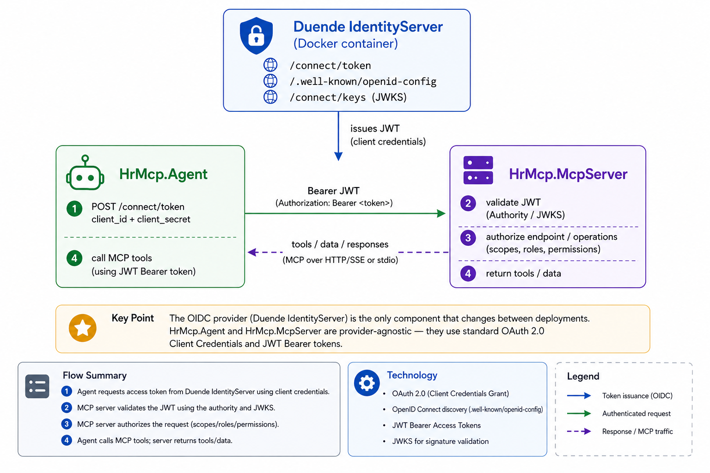

# Part 6: Securing the MCP Server with OIDC

**Series:** AI Agents & MCP with .NET 10 | **Part 6 of 6**  
**GitHub:** [workcontrolgit/DotnetAiAgentMcp](https://github.com/workcontrolgit/DotnetAiAgentMcp)

---

## Introduction

The MCP server we built in Parts 3–5 listens on `http://localhost:5100/mcp` with no authentication. On a developer laptop that is fine — nothing reaches the port except local processes. But the moment you deploy the server to a shared environment, a container, or a cloud VM, any process that can reach the network can call your HR tools, read position data, and trigger AI generation at your cost.

This part adds JWT Bearer authentication using OpenID Connect (OIDC). The pattern is standard ASP.NET Core:

- The MCP server becomes a **resource server** — it validates JWT tokens on every request.
- The agent (or any client) becomes an **OAuth2 client** — it acquires a token via the client credentials flow before connecting.
- An external **OIDC provider** issues and validates tokens.

The working example uses **Duende IdentityServer** running in Docker — a self-hosted .NET identity server you control completely. Because the code speaks standard OIDC, swapping to a cloud provider (Okta, Azure Entra ID, Google) requires only two config values. That swap is covered at the end of this part.

The surface area of change is small: four lines in `Program.cs`, two values in `appsettings.Development.json`, and token acquisition in the agent.

---

## Architecture



The OIDC provider is the only component that changes between deployments. The server and agent code are provider-agnostic — they speak standard JWT Bearer and OAuth2 client credentials.

---

## Provider Options

Any standards-compliant OIDC provider works. This part uses Duende IdentityServer because it runs locally in Docker with no external accounts or network dependencies.

- **Duende IdentityServer** — open-source .NET identity server; runs in Docker; full control over clients, scopes, and users; free community license for development; production license required for revenue-generating use. This is the provider used in this walkthrough.
- **Okta** — free developer account supports up to 1,000 monthly active users; well-documented client credentials setup; hosted, no infrastructure required.
- **Azure Entra ID (formerly Azure AD)** — use App Registrations with a client secret; integrates with MSAL and Azure RBAC; free tier available in Azure portal.
- **Google Cloud Identity Platform** — OAuth2 service accounts support client credentials; configure via Google Cloud Console.

---

## Step 1 — Add JWT Bearer to `HrMcp.McpServer`

```bash
dotnet add src/HrMcp.McpServer package Microsoft.AspNetCore.Authentication.JwtBearer --version 9.*
```

> **Note:** `Microsoft.AspNetCore.Authentication.JwtBearer` ships as a standalone NuGet package. For .NET 10 projects targeting ASP.NET Core, version `9.*` is the current stable release that works on net10.0.

---

## Step 2 — Update `appsettings.json`

Add the `Oidc` section with placeholder values. Real values go in `appsettings.Development.json` (gitignored) or environment variables — never committed:

```json
{
  "ConnectionStrings": {
    "DefaultConnection": "Server=(localdb)\\mssqllocaldb;Database=HrMcpDb;Trusted_Connection=True;"
  },
  "Urls": "http://localhost:5100",
  "Oidc": {
    "Authority": "https://YOUR-OIDC-PROVIDER",
    "Audience": "hr-mcp"
  },
  "Logging": {
    "LogLevel": {
      "Default": "Information",
      "Microsoft.AspNetCore": "Warning"
    }
  },
  "AllowedHosts": "*"
}
```

For local development with the Duende Docker container, override in `appsettings.Development.json` (gitignored):

```json
{
  "Oidc": {
    "Authority": "https://localhost:44310",
    "Audience": "hr-mcp"
  }
}
```

The `Authority` is the base URL of the IdentityServer — the JWT Bearer middleware fetches the JWKS automatically from `{Authority}/.well-known/openid-configuration`. The `Audience` must match the API Resource name registered in the identity server.

---

## Step 3 — Add Authentication Middleware to `Program.cs`

The full updated `Program.cs`. The four new lines are marked `// NEW` and one line is marked `// CHANGED`:

```csharp
// src/HrMcp.McpServer/Program.cs
using HrMcp.Application.Services;
using HrMcp.Infrastructure.Persistence;
using HrMcp.McpServer.Tools;
using Microsoft.AspNetCore.Authentication.JwtBearer;   // NEW
using Microsoft.EntityFrameworkCore;
using Microsoft.Extensions.AI;
using OllamaSharp;

var isStdio = args.Contains("--stdio");

var builder = WebApplication.CreateBuilder(args);

if (isStdio)
{
    builder.Logging.ClearProviders();
    builder.Logging.AddConsole(o => o.LogToStandardErrorThreshold = Microsoft.Extensions.Logging.LogLevel.Trace);
    builder.WebHost.UseUrls();
}

builder.Services.AddPersistence(
    builder.Configuration.GetConnectionString("DefaultConnection")!);
builder.Services.AddScoped<PositionService>();
builder.Services.AddScoped<HiringOrganizationService>();

builder.Services.AddSingleton<IChatClient>(
    new OllamaApiClient(new Uri("http://localhost:11434"), "llama3.2"));

// NEW — JWT Bearer authentication
builder.Services
    .AddAuthentication(JwtBearerDefaults.AuthenticationScheme)
    .AddJwtBearer(options =>
    {
        options.Authority = builder.Configuration["Oidc:Authority"];
        options.Audience  = builder.Configuration["Oidc:Audience"];

        // Trust self-signed certificates when running against a local
        // Duende IdentityServer Docker container in Development.
        // Remove this block when pointing at a cloud provider or a
        // production server with a trusted certificate.
        if (builder.Environment.IsDevelopment())
            options.BackchannelHttpHandler = new HttpClientHandler
            {
                ServerCertificateCustomValidationCallback =
                    HttpClientHandler.DangerousAcceptAnyServerCertificateValidator
            };
    });
builder.Services.AddAuthorization();  // NEW

var mcp = builder.Services
    .AddMcpServer()
    .WithTools<PositionTools>()
    .WithTools<HiringOrganizationTools>()
    .WithTools<JobDescriptionTools>();

if (isStdio)
    mcp.WithStdioServerTransport();
else
    mcp.WithHttpTransport();

var app = builder.Build();

using (var scope = app.Services.CreateScope())
{
    var db = scope.ServiceProvider.GetRequiredService<HrDbContext>();
    db.Database.Migrate();
    var seedPath = Path.Combine(Directory.GetCurrentDirectory(), "data", "usajobs-seed.json");
    DbSeeder.Seed(db, seedPath);
}

app.UseAuthentication();  // NEW
app.UseAuthorization();   // NEW

if (!isStdio)
    app.MapMcp("/mcp").RequireAuthorization();  // CHANGED

await app.RunAsync();
```

With this in place, any HTTP request to `/mcp` without a valid JWT returns `401 Unauthorized`. Stdio transport is unaffected — `MapMcp` is not called in stdio mode.

The `BackchannelHttpHandler` block handles the self-signed certificate that Duende's Docker compose setup uses for the nginx reverse proxy. When you switch to a cloud provider with a trusted certificate, delete that block.

---

## Step 4 — Agent Token Acquisition

The agent acquires a token via the OAuth2 client credentials flow and passes it as a bearer header using `HttpClientTransportOptions.AdditionalHeaders`.

> **Package version note:** If you are using OllamaSharp 5.4 or later, set `Microsoft.Extensions.AI` to version `10.*` in `HrMcp.Agent.csproj`. OllamaSharp 5.4+ pulls `Microsoft.Extensions.AI.Abstractions 10.4.x` transitively, which causes a `TypeLoadException` at runtime when the direct package is pinned at `9.*`.

```csharp
// src/HrMcp.Agent/Program.cs
using Microsoft.Extensions.AI;
using ModelContextProtocol.Client;
using OllamaSharp;
using HrMcp.Agent;
using System.Net.Http.Json;
using System.Text.Json;

// --- Token acquisition (client credentials flow) ---
// The HttpClientHandler below trusts the self-signed certificate used by the
// local Duende IdentityServer Docker container. Remove it when using a cloud
// provider or a server with a trusted certificate.
using var tokenHandler = new HttpClientHandler
{
    ServerCertificateCustomValidationCallback =
        HttpClientHandler.DangerousAcceptAnyServerCertificateValidator
};
using var tokenClient = new HttpClient(tokenHandler);

var tokenResponse = await tokenClient.PostAsync(
    "https://localhost:44310/connect/token",
    new FormUrlEncodedContent(new Dictionary<string, string>
    {
        ["grant_type"]    = "client_credentials",
        ["client_id"]     = "hr-mcp-agent",
        ["client_secret"] = "hr-mcp-agent-secret",
        ["scope"]         = "hr-mcp-api",
    }));
tokenResponse.EnsureSuccessStatusCode();

var tokenDoc    = await tokenResponse.Content.ReadFromJsonAsync<JsonElement>();
var accessToken = tokenDoc.GetProperty("access_token").GetString()!;
Console.WriteLine("Token acquired.\n");

// --- Connect to MCP server with bearer token ---
await using var mcpClient = await McpClient.CreateAsync(
    new HttpClientTransport(new HttpClientTransportOptions
    {
        Endpoint = new Uri("http://localhost:5100/mcp"),
        AdditionalHeaders = new Dictionary<string, string>
        {
            ["Authorization"] = $"Bearer {accessToken}"
        }
    }));

var mcpTools = await mcpClient.ListToolsAsync();
Console.WriteLine($"Connected. Tools: {string.Join(", ", mcpTools.Select(t => t.Name))}\n");

IChatClient chatClient = ((IChatClient)new OllamaApiClient(
        new Uri("http://localhost:11434"), "llama3.2"))
    .AsBuilder()
    .UseFunctionInvocation()
    .Build();

var agent = new HrAgent(chatClient, mcpTools.Cast<AITool>().ToList());
await agent.RunAsync();
```

Key points:

- **`AdditionalHeaders`** on `HttpClientTransportOptions` — sends the `Authorization` header with every request to the MCP server.
- **`tokenHandler` with cert bypass** — required when the IdentityServer container uses a self-signed certificate. Remove for cloud providers.
- **Client credentials** — for production, move `client_id` and `client_secret` to environment variables or a secrets manager. Never commit credentials to source control.
- **`scope`** — the scope name must match what is registered in the identity server. Omit if your provider does not require scope for client credentials.

---

## Duende IdentityServer Docker Setup

This walkthrough uses the [Skoruba Duende IdentityServer Admin UI](https://github.com/skoruba/Duende.IdentityServer.Admin) Docker compose project — a production-ready identity server with a web admin panel, all running locally in Docker.

**1. Clone and start the containers**

```bash
git clone https://github.com/skoruba/Duende.IdentityServer.Admin
cd Duende.IdentityServer.Admin
docker-compose up -d
```

The nginx reverse proxy exposes the STS at `https://localhost:44310`. The admin UI is at `https://localhost:44303`.

**2. Add the HR MCP API scope, resource, and client**

The container seeds its database from `shared/identityserverdata.json` on first start. Add the following entries, then restart with `docker-compose up -d --force-recreate` to re-seed:

In the `ApiScopes` array:

```json
{
  "Name": "hr-mcp-api",
  "DisplayName": "HR MCP API",
  "Required": true
}
```

In the `ApiResources` array:

```json
{
  "Name": "hr-mcp",
  "Scopes": [ "hr-mcp-api" ]
}
```

In the `Clients` array:

```json
{
  "ClientId": "hr-mcp-agent",
  "ClientName": "HR MCP Agent",
  "AllowedGrantTypes": [ "client_credentials" ],
  "RequireClientSecret": true,
  "ClientSecrets": [
    { "Value": "hr-mcp-agent-secret" }
  ],
  "RequirePkce": false,
  "AllowedScopes": [ "hr-mcp-api" ]
}
```

**3. Configure the MCP server**

`appsettings.Development.json` (gitignored):

```json
{
  "Oidc": {
    "Authority": "https://localhost:44310",
    "Audience": "hr-mcp"
  }
}
```

The `Audience` value must match the `ApiResource` name — `hr-mcp` — not the scope name.

**4. Verify the token endpoint**

```bash
curl -sk -X POST https://localhost:44310/connect/token \
  -d "grant_type=client_credentials&client_id=hr-mcp-agent&client_secret=hr-mcp-agent-secret&scope=hr-mcp-api"
```

A successful response returns an `access_token` JWT. Decode it at [jwt.io](https://jwt.io) and confirm `aud: hr-mcp` and `scope: hr-mcp-api`.

**5. Verify 401 protection**

```bash
curl -i http://localhost:5100/mcp
# HTTP/1.1 401 Unauthorized
```

**6. Run the agent end-to-end**

```bash
dotnet run --project src/HrMcp.Agent
# Token acquired.
# Connected. Tools: GetOpenPositions, WriteJobDescription, ...
```

---

## Swapping to a Cloud Provider

Because the server and agent speak standard OIDC and OAuth2, switching providers requires changing only the `Authority`, `Audience`, and token endpoint. Remove the `DangerousAcceptAnyServerCertificateValidator` block — cloud providers have trusted certificates.

**Okta**

`appsettings.Development.json`:

```json
{
  "Oidc": {
    "Authority": "https://dev-abc123.okta.com/oauth2/default",
    "Audience": "api://default"
  }
}
```

Agent token endpoint: `https://dev-abc123.okta.com/oauth2/default/v1/token`

Setup: Okta admin console → Applications → Create App Integration → API Services. Create a custom scope `hr-mcp-api` under Security → API → Authorization Servers → default → Scopes.

**Azure Entra ID**

`appsettings.Development.json`:

```json
{
  "Oidc": {
    "Authority": "https://login.microsoftonline.com/{tenant-id}/v2.0",
    "Audience": "api://{client-id}"
  }
}
```

Agent token endpoint: `https://login.microsoftonline.com/{tenant-id}/oauth2/v2.0/token`

Agent scope: `{client-id}/.default`

Setup: Azure portal → App Registrations → New registration → Certificates & secrets → Client secrets. Expose an API and add a scope.

**Google Cloud**

Google uses service accounts rather than client credentials for machine-to-machine. The OIDC discovery endpoint is `https://accounts.google.com`. Use a service account key to exchange for a token via the Google OAuth2 token endpoint.

---

## Optional — Tool-Level Role Check

JWT Bearer middleware secures the entire `/mcp` endpoint. If you need finer control — for example, only users with an `hr-admin` role can call `WriteJobDescription` — inject `IHttpContextAccessor` into the tool:

```csharp
// src/HrMcp.McpServer/Tools/JobDescriptionTools.cs
using Microsoft.AspNetCore.Http;

[McpServerToolType]
public sealed class JobDescriptionTools(
    PositionService positions,
    IChatClient chatClient,
    IHttpContextAccessor httpContextAccessor)
{
    [McpServerTool(Name = "WriteJobDescription"),
     Description("Generates a USAJobs-style job announcement using AI.")]
    public async Task<string> WriteJobDescription(int positionId, CancellationToken ct = default)
    {
        var user = httpContextAccessor.HttpContext?.User;
        if (user?.IsInRole("hr-admin") != true)
            return "Unauthorized: WriteJobDescription requires the hr-admin role.";

        // ... rest of implementation
    }
}
```

Register `IHttpContextAccessor` in `Program.cs`:

```csharp
builder.Services.AddHttpContextAccessor();
```

For Duende IdentityServer, add a `role` claim to the client token by including `UserClaims: [ "role" ]` on the API scope and setting the `role` property on the client. Cloud providers handle role claims differently — Okta uses `groups`, Entra uses app roles defined in the manifest.

---

## Step 5 — Build

```bash
dotnet build DotnetAiAgentMcp.slnx   # 0 errors, 0 warnings
```

The JWT Bearer middleware compiles without a live provider — the `Authority` and `Audience` values are read at runtime. A missing or incorrect `Authority` produces a runtime warning on first request, not a build error.

---

## What We Built

Across the six parts of this series you have built a complete, production-shaped AI agent stack:

**Infrastructure**
- Clean Architecture .NET 10 solution: Core, Application, Infrastructure.Persistence, McpServer, Agent
- EF Core migrations, SQL Server, `DbSeeder` with USAJobs data
- Self-contained `HrMcp.McpServer.exe` for desktop and server deployment

**MCP Server (`HrMcp.McpServer`)**
- Five typed tools: `GetOpenPositions`, `GetPositionById`, `GetPositionsByOrganization`, `GetHiringOrganizations`, `WriteJobDescription`
- Dual transport: stdio for Claude Desktop, HTTP/SSE for programmatic clients
- JWT Bearer authentication — any OIDC provider, configured via `appsettings.json`

**AI Agent (`HrMcp.Agent`)**
- `IChatClient` abstraction (Microsoft.Extensions.AI) with `OllamaApiClient` (OllamaSharp)
- `UseFunctionInvocation` middleware — automatic tool dispatch, no manual routing
- System prompt with HR-domain guidelines
- Full conversation history across turns

**Integration**
- Claude Desktop — stdio transport, `claude_desktop_config.json`, hammer icon
- VS Code Copilot Chat — `.vscode/mcp.json`, HTTP transport, `@hr-mcp`
- MCP Inspector — HTTP mode testing and debugging

---

## Sources

- [OpenID Connect — Introduction](https://openid.net/developers/how-connect-works/)
- [JWT Bearer — Microsoft Docs](https://learn.microsoft.com/en-us/aspnet/core/security/authentication/jwt-authn)
- [OAuth2 Client Credentials Flow — RFC 6749](https://datatracker.ietf.org/doc/html/rfc6749#section-4.4)
- [Duende IdentityServer — Overview](https://duendesoftware.com/products/identityserver)
- [Skoruba Duende IdentityServer Admin UI — GitHub](https://github.com/skoruba/Duende.IdentityServer.Admin)
- [ModelContextProtocol C# SDK — GitHub](https://github.com/modelcontextprotocol/csharp-sdk)
- [Okta Developer — Client Credentials](https://developer.okta.com/docs/guides/implement-grant-type/clientcreds/main/)
- [Azure Entra ID — App Registrations](https://learn.microsoft.com/en-us/entra/identity-platform/quickstart-register-app)
- [Microsoft.AspNetCore.Authentication.JwtBearer — NuGet](https://www.nuget.org/packages/Microsoft.AspNetCore.Authentication.JwtBearer)
