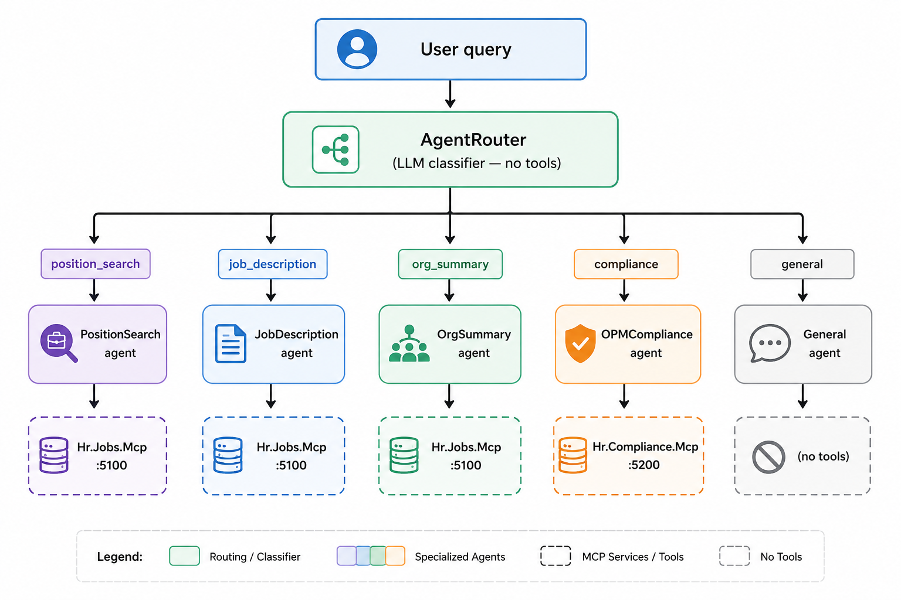

# Why One Agent Is Not Enough

*Preface to: Building Multi-Agent Systems with .NET 10*

---

You built an AI agent. It connects to your MCP server, calls your tools, and returns intelligent answers. It works. You demo it for your team, they love it, and you start thinking about production.

Then someone asks: "Can it search for open IT positions, write a job description for the best one, and check if it meets OPM compliance — all in one conversation?"

You type the request. The agent calls a search tool, finds a position, then... calls the compliance tool instead of the job description tool. You try again. This time it writes a description, but the qualifications section is generic — it did not use the actual position data. Third attempt: it gets it right, but the compliance check references the wrong position ID.

This is not a bug. This is the fundamental limit of a single general-purpose agent.

---

## The Two Problems That Kill Single-Agent Quality

**Problem 1: Tool overload.**

An agent with 12 tools is an agent that makes 12 choices before answering your question. The LLM must scan the full list of tool names and descriptions on every turn, rank them by relevance to the current query, and pick the right one. When tools overlap — `GetPositionById` and `GetOpenPositions` both relate to positions — the model hedges. It sometimes calls the wrong one. It sometimes calls both. The more tools you add, the worse this gets.

Research from Anthropic and others consistently shows that agent accuracy degrades as the tool count rises above 8–10. A single agent handling search, writing, compliance, and organization queries needs at least 12 tools. You are starting from a position of handicap.

**Problem 2: Prompt dilution.**

A system prompt that says "you are a helpful federal HR assistant who can search positions, write job descriptions, check OPM compliance, and summarize organizations" is doing four jobs at once. The LLM tries to be all of them simultaneously, and ends up being none of them particularly well.

A job description writer needs to be told: synthesize duties into bullets, use second-person voice, always state a grade-level experience equivalency. A compliance checker needs to be told: report Pass/Fail per rule, reference the OPM standard URL, suggest specific corrections. You cannot fit both sets of instructions into one prompt without watering both down.

---

## A Concrete Failure to Anchor the Series

Here is a real single-agent conversation log from `Hr.Agent` — the baseline project in the tutorial repository:

```
You: Find an open IT Specialist position and write a job description for it,
     then check if it passes OPM compliance.

Agent: [calls GetOpenPositions]
Agent: [calls WriteJobDescription with positionId=3]
Agent: Here is the draft:

  ## Summary
  Join the federal workforce as an IT Specialist...

  ## Qualifications Required
  One year of specialized experience in a related field...

Agent: [calls RunFullComplianceCheck with positionId=3]
Agent: The compliance check shows a WARNING on QualificationsGradeReference.
       The qualifications text does not reference the advertised grade GS-12.

[The same draft that was just generated has already failed compliance.
 The agent did not notice, and did not save the draft.]
```

Three problems in one conversation:
- The qualifications text the agent generated is the very text that fails the compliance rule
- The agent did not route the compliance failure back to the writer to fix it
- The draft was never saved — when the conversation ends, it disappears

This is what a single general-purpose agent produces under realistic conditions.

---

## The Multi-Agent Answer

Multi-agent systems solve these problems by giving each agent exactly one job:

**Specialist agents** receive a focused system prompt and a small tool subset. The job description writer gets 5 tools and a 150-word prompt about federal HR writing style. The compliance checker gets 7 tools and a prompt about OPM standards. Neither agent is distracted by the other's concerns.

**A router** classifies each user message and delegates to the right specialist. The router itself makes no tool calls — it just reads the message and outputs a single intent label. This keeps routing latency low and classification accuracy high.

**An orchestrator** manages the loop: receive message, classify intent, delegate, return response.

The result is a system where each agent does one thing well, receives only the tools it needs, and operates under a prompt written specifically for its domain.

---

## Four Patterns, One Series

This series implements the Selector pattern across 7 posts, using a real federal HR use case — job position management with OPM compliance checking — as the running example.

The four production multi-agent patterns are:

**Selector** (this series): A router classifies each query and delegates to one specialist. Best for systems where requests fall into distinct, non-overlapping categories.

**Pipe**: Agents chain sequentially, each transforming the output of the last. Best for workflows where output quality depends on ordered refinement — like draft → review → format.

**Group Chat**: Multiple agents run in parallel on the same query, and a moderator synthesizes their responses. Best for decisions that benefit from diverse perspectives.

**Evaluator-Optimizer**: A critic agent scores a drafter's output and sends it back for revision until a quality threshold is met. Best for content generation where "good enough" is not good enough.

---

## What You Will Build

By the end of this series you will have a working multi-agent system backed by real USAJobs data:

- **Hr.Jobs.Mcp** — MCP server on port 5100: HR data tools, AI-powered job description writer, announcement persistence
- **Hr.Compliance.Mcp** — MCP server on port 5200: 7 deterministic OPM compliance rules, zero LLM calls
- **Hr.SelectorOrchestrator** — Multi-agent selector: LLM router + 5 specialist agents, each with a focused prompt and tool subset

The same two MCP servers also connect directly to Claude Desktop, giving you a second way to run the system — no orchestrator code required.

The full architecture:



---

## Prerequisites

Before starting, you need:

- .NET 10 SDK
- SQL Server LocalDB (ships with Visual Studio)
- Ollama with `llama3.2` pulled: `ollama pull llama3.2`
- A USAJobs API key (free at usajobs.gov/Developer) — only needed to re-seed data; the repository includes a pre-built seed file

Clone the repository and confirm it builds:

```bash
git clone https://github.com/workcontrolgit/DotnetMultiAgentsTutorial.git
cd DotnetMultiAgentsTutorial/DotnetMultiAgents
dotnet build DotnetMultiAgents.slnx
```

Expected output: `Build succeeded. 0 Warning(s). 0 Error(s).`

---

**Next: Part 1 — The .NET Agent Framework: IChatClient and MCP Clients**

[View the repository](https://github.com/workcontrolgit/DotnetMultiAgentsTutorial)
